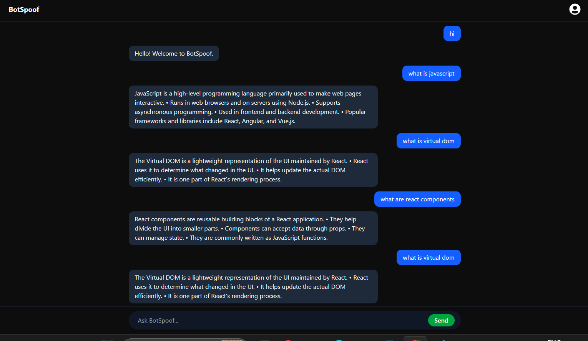

# BotSpoof --- MERN Chatbot Application

A full-stack chatbot application built with the MERN stack. BotSpoof
provides a responsive chat interface where users can ask questions and
receive answers from a predefined knowledge base. Chat messages and bot
responses are stored in MongoDB.

## Live Demo

-   **Frontend:** [BotSpoof](https://chatbot-one-iota-22.vercel.app/)
-   **Backend:** [Render API](https://chatbot-backend-x5dz.onrender.com)
-   **GitHub Repository:**
    [SurajPatil-Tech/chatbot](https://github.com/SurajPatil-Tech/chatbot)

## Screenshot



## Features

-   Responsive chatbot interface
-   Send messages and view bot responses
-   Predefined knowledge base for answering supported questions
-   Fallback response for questions the bot does not recognize
-   Stores user messages and bot responses in MongoDB
-   React hooks for managing input, chat state, and scrolling
-   REST API built with Express
-   Frontend and backend deployed separately

## Tech Stack

**Frontend** - React - Vite - Tailwind CSS - Axios

**Backend** - Node.js - Express.js - REST API

**Database** - MongoDB Atlas - Mongoose

## Project Structure

``` text
chatbot/
├── backend/
│   ├── controller/
│   │   └── chatbot.message.js
│   ├── model/
│   │   ├── bot.model.js
│   │   └── user.model.js
│   ├── routes/
│   │   └── chatbot.route.js
│   ├── index.js
│   ├── package.json
│   └── .env
├── frontend/
│   ├── src/
│   │   ├── component/
│   │   │   └── Bot.jsx
│   │   └── App.jsx
│   ├── package.json
│   └── ...
├── screenshots/
│   └── chatbot.png
└── README.md
```

## Getting Started

### Prerequisites

-   Node.js and npm
-   MongoDB Atlas account or a local MongoDB instance
-   Git

### 1. Clone the repository

``` bash
git clone https://github.com/SurajPatil-Tech/chatbot.git
cd chatbot
```

### 2. Install backend dependencies

``` bash
cd backend
npm install
```

Create a `.env` file inside the `backend` directory:

``` env
PORT=3000
MONGO_URI=your_mongodb_connection_string
```

Replace `your_mongodb_connection_string` with your MongoDB connection
string. Keep `.env` private and do not commit it to GitHub.

Start the backend:

``` bash
npm start
```

### 3. Install frontend dependencies

Open a second terminal from the project root:

``` bash
cd frontend
npm install
```

Create a `.env` file inside the `frontend` directory:

``` env
VITE_API_URL=http://localhost:3000
```

Start the frontend development server:

``` bash
npm run dev
```

Open the local URL printed by Vite in your terminal.

## API Endpoint

  -----------------------------------------------------------------------
  Method                  Endpoint                Description
  ----------------------- ----------------------- -----------------------
  POST                    `/bot/v1/message`       Sends a message to the
                                                  chatbot and receives a
                                                  response

  -----------------------------------------------------------------------

## Deployment

-   **Frontend:** Deployed on Vercel
-   **Backend:** Deployed on Render
-   **Database:** MongoDB Atlas

For the deployed frontend, configure the `VITE_API_URL` environment
variable in Vercel with the backend URL:

``` env
VITE_API_URL=https://chatbot-backend-x5dz.onrender.com
```

After changing a Vite environment variable in Vercel, redeploy the
frontend for the change to take effect.

## Author

**Suraj Patil**

-   GitHub: [SurajPatil-Tech](https://github.com/SurajPatil-Tech)
-   LinkedIn:
    [surajpatil-tech](https://www.linkedin.com/in/surajpatil-tech)
